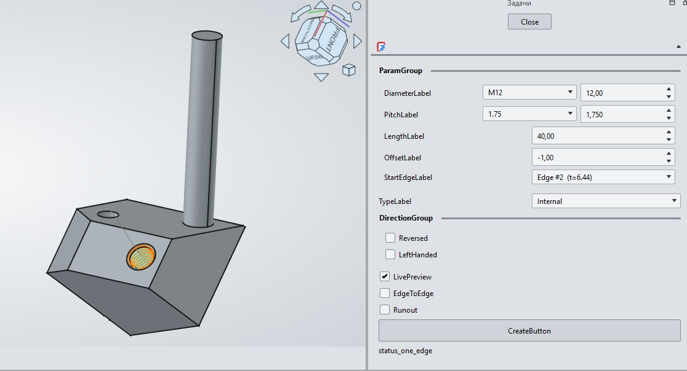
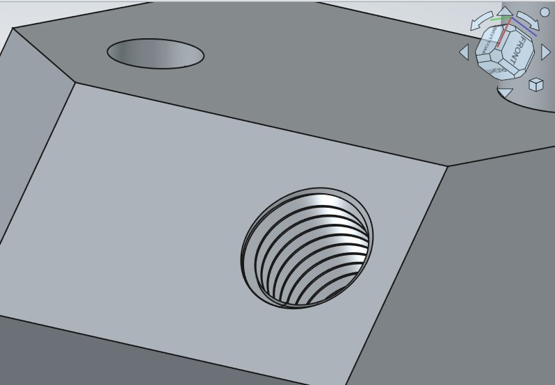

# Thread Workbench for FreeCAD

<!-- RU -->
## 🇷🇺 Описание

**Thread Workbench** — это верстак для FreeCAD, предназначенный для удобной генерации метрических и дюймовых резьб

Версия: **0.1.1**

### Зачем нужен
Этот верстак автоматизирует процесс: достаточно выбрать цилиндрическую грань, задать параметры резьбы — и геометрия будет построена корректно и параметрически.

### Что позволяет
- **Автоматический подбор параметров** — выбор диаметра и шага из стандартных рядов (метрические M, дюймовые UNC/UNF и др.).
- **Внешняя и внутренняя резьба** — создание наружной и внутренней резьбы
- **Смещение от кромки** — возможность задать отступ начала резьбы от края грани.
- **Левая резьба и реверс** — поддержка левосторонней резьбы и инверсии направления наращивания.
- **Плавный выход** — опция добавления аддитивного вращения в дальнем конце резьбы для плавного замыкания витков в стиле Fusion 360
- **Профили резьбы** — поддержка различных профилей (ISO 68/1 и других через реестр профилей).
- **Предпросмотр** — live-preview перед финальным созданием операции.
- **Мультиязычность** — интерфейс переводится через стандартную систему переводов.

### ⚠️ Важно
Проект находится на **ранней стадии разработки**. Возможны баги, вылеты и изменения в API/интерфейсе. Перед использованием в важных проектах рекомендуется сохранять резервные копии документов.

### Установка
1. Скопируйте содержимое репозитория в папку модулей FreeCAD:
   - **Windows**: `%APPDATA%\FreeCAD\Mod\ThreadWorkbench\`
   - **Linux/macOS**: `~/.FreeCAD/Mod/ThreadWorkbench/`
2. Перезапустите FreeCAD.
3. Верстак появится в списке доступных workbenches под именем **Thread**.

### Использование
1. Переключитесь на верстак **Thread**.
2. Выделите цилиндрическую грань объекта, находящегося внутри `PartDesign::Body`.
3. Укажите диаметр, шаг, длину и тип резьбы (наружная / внутренняя).
4. Нажмите **Create Thread**.

### Лицензия
GPL-3.0-or-later (см. файл [LICENSE](LICENSE)).

---

<!-- EN -->
## 🇬🇧 Description

**Thread Workbench** is a FreeCAD workbench for convenient generation of metric and inch threads.

Version: **0.1.0**

### Why it exists
This workbench automates the process: just select a cylindrical face, set the thread parameters — and the geometry will be built correctly and parametrically.

### Features
- **Automatic parameter selection** — choose diameter and pitch from standard series (metric M, inch UNC/UNF, etc.).
- **External & internal threads** — create external and internal threads.
- **Edge offset** — set a distance from the face edge where the thread starts.
- **Left-handed & reversed** — support for left-hand threads and reverse build direction.
- **Smooth runout** — option to add an additive revolution at the far end of the thread for smooth groove closure, Fusion 360 style.
- **Thread profiles** — support for multiple profiles (ISO 68/1 and others via the profile registry).
- **Live preview** — preview the result before committing the operation.
- **Multilingual** — UI is translatable via the standard FreeCAD translation system.

### ⚠️ Important
This project is in **early development**. Bugs, crashes, and API/UI changes are possible. Please save backup copies of your documents before using it on critical projects.

### Installation
1. Copy the repository contents into your FreeCAD Mod directory:
   - **Windows**: `%APPDATA%\FreeCAD\Mod\ThreadWorkbench\`
   - **Linux/macOS**: `~/.FreeCAD/Mod\ThreadWorkbench/`
2. Restart FreeCAD.
3. The workbench will appear in the available workbenches list as **Thread**.

### Usage
1. Switch to the **Thread** workbench.
2. Select a cylindrical face of an object inside a `PartDesign::Body`.
3. Set diameter, pitch, length, and thread type (external / internal).
4. Press **Create Thread**.

### License
GPL-3.0-or-later (see [LICENSE](LICENSE)).

---

## Скриншоты / Screenshots

